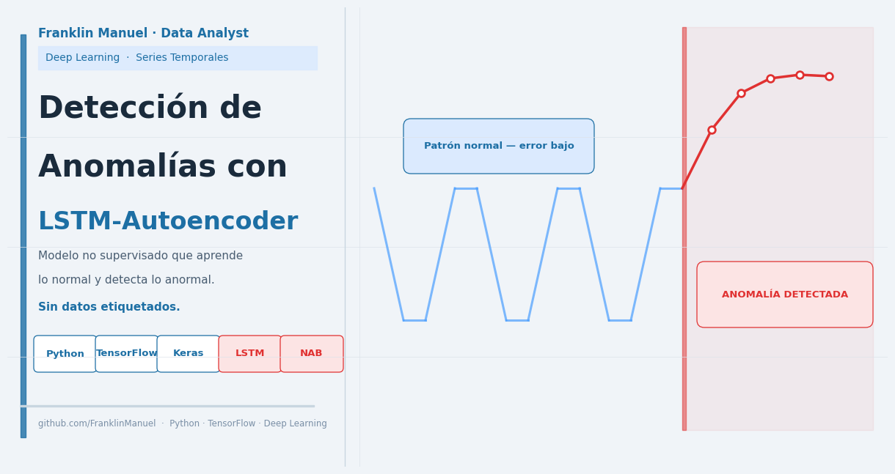

# Detección de Anomalías con LSTM-Autoencoder

> > Implementación de una arquitectura de deep learning basada en LSTM-Autoencoder para detectar anomalías en series temporales mediante aprendizaje no supervisado, sin necesidad de datos etiquetados.

---

## Resultado

| Métrica | Valor |
|---|---|
| Arquitectura | LSTM-Autoencoder (Encoder 32 unidades) |
| Anomalías detectadas | 100% de los saltos abruptos identificados |
| Entrenamiento | Solo con datos normales — sin ejemplos de anomalías |
| Dataset | Numenta Anomaly Benchmark (NAB) |

---

## Tecnologías


| Herramienta | Uso |
|---|---|
| TensorFlow / Keras | Construcción y entrenamiento del modelo |
| NumPy / Pandas | Manipulación de datos |
| Matplotlib | Visualización |

---

## Cómo Ejecutar

1. Abre el notebook en Google Colab o Jupyter
2. Ejecuta todas las celdas en orden — los datos se descargan automáticamente
3. No se requiere ninguna configuración adicional

```bash
pip install tensorflow numpy pandas matplotlib
```

---

## Tabla de Contenidos

- [1. Identificación del Problema](#1-identificación-del-problema)
- [2. Los Datos — Cómo se utilizan para resolver el problema](#2-los-datos--cómo-se-utilizan-para-resolver-el-problema)
- [3. Conclusiones Finales](#3-conclusiones-finales)

---

## 1. Identificación del Problema

### ¿Qué problema existe?

En industrias como banca, manufactura, salud o tecnología, es crítico saber cuándo algo se está comportando de manera anormal:

- Un banco necesita detectar transacciones fraudulentas antes de que el daño ocurra
- Una fábrica necesita saber cuándo una máquina está a punto de fallar
- Un equipo de tecnología necesita anticipar caídas de servidores

El problema es siempre el mismo: **¿cómo detectar lo anormal si no tenemos ejemplos de lo que es anormal?**

### ¿Qué propone este proyecto?

En lugar de aprender qué es una anomalía, el modelo aprende qué es el comportamiento **normal**. Cuando aparece algo que se desvía demasiado, lo marca como anomalía.

> **Ejemplo:** Un detector de incendios no sabe cómo es un incendio — solo sabe cómo huele el aire normal. Cuando el olor cambia más allá de cierto límite, dispara la alarma. Este modelo funciona exactamente igual.

### ¿Por qué se usa LSTM?

Los datos son **series temporales** — mediciones a lo largo del tiempo donde el valor actual depende de los anteriores. El LSTM (Long Short-Term Memory) es una red neuronal diseñada específicamente para aprender patrones en secuencias, porque tiene memoria del pasado.

---

## 2. Los Datos — Cómo se utilizan para resolver el problema

### ¿Qué datos se usan?

**Numenta Anomaly Benchmark (NAB)** — dataset público, se descarga automáticamente.

| Archivo | Contenido | Para qué se usa |
|---|---|---|
| `art_daily_small_noise.csv` | Serie sin anomalías | Entrenar el modelo |
| `art_daily_jumpsup.csv` | Serie con saltos abruptos | Evaluar si detecta las anomalías |

### ¿Cómo usa el modelo los datos?

**Paso 1 — Comprimir:** Lee 288 puntos de tiempo y los resume en 32 números.

$$z = \text{LSTM}_{\text{encoder}}(X) \quad \rightarrow \quad z \in \mathbb{R}^{32}$$

**Paso 2 — Preparar:** El resumen se repite 288 veces para reconstruir punto por punto.

$$Z_{\text{seq}} = [\,z,\; z,\; \dots,\; z\,]_{\;288 \text{ veces}}$$

>El encoder transforma secuencias temporales en una representación latente compacta de 32 dimensiones, preservando los patrones normales del sistema.

**Paso 3 — Reconstruir:** El modelo regenera la serie original a partir del resumen.

$$\hat{H} = \text{LSTM}_{\text{decoder}}(Z_{\text{seq}})$$

**Paso 4 — Medir el error:** Se compara lo reconstruido contra lo real con el MAE.

$$\text{MAE} = \frac{1}{288} \sum_{t=1}^{288} \left| x_t - \hat{x}_t \right|$$

- Error bajo → dato normal
- Error alto → anomalía detectada

**Paso 5 — Umbral:** El peor error en datos normales se convierte en el límite de detección.

```
Si MAE en datos nuevos > Umbral → ANOMALÍA
```

### Flujo del proyecto (pipeline)

> **Pipeline** es la secuencia ordenada de pasos que siguen los datos desde que entran hasta que se obtiene el resultado final.

```
1. Carga de datos (NAB)
        ↓
2. Normalización (media 0, std 1)
        ↓
3. Creación de ventanas temporales (TIME_STEPS = 288)
        ↓
4. Entrenamiento del LSTM-Autoencoder (solo datos normales)
        ↓
5. Cálculo del umbral: max(MAE) en datos de entrenamiento
        ↓
6. Evaluación en datos con anomalías
        ↓
7. Detección: muestras con MAE > umbral → ANOMALÍA
        ↓
8. Visualización de anomalías sobre la serie original
```

### Arquitectura del modelo

| Capa | Función |
|---|---|
| LSTM Encoder | Lee 288 pasos y los comprime en 32 números |
| Dropout 20% | Evita que el modelo memorice en lugar de aprender |
| RepeatVector | Prepara el resumen para la reconstrucción |
| LSTM Decoder | Reconstruye la serie punto por punto |
| Dense (salida) | Convierte los estados internos a valores reales |

**Optimizador:** Adam · **Pérdida:** MSE · **Early Stopping:** patience=5

---

## 3. Conclusiones Finales

### ¿Funcionó?

El modelo logró identificar correctamente los saltos abruptos presentes en la serie temporal de prueba utilizando únicamente datos normales durante el entrenamiento.

### ¿Qué aprendimos?

El enfoque no supervisado es viable y efectivo cuando no se tienen datos etiquetados — que es el caso más común en problemas reales de industria.

### ¿Qué limitaciones tiene?

- El umbral se fija durante el entrenamiento; si el comportamiento normal cambia, el modelo necesita reentrenarse
- No identifica el tipo de anomalía, solo señala que algo está fuera de lo normal
- Requiere volumen suficiente de datos normales para aprender el patrón

### ¿Qué sigue?

Aplicarlo a datos reales de una industria específica, ajustar el umbral dinámicamente y conectarlo a un sistema de alertas automáticas.

---
## Habilidades Demostradas

- Deep Learning
- Detección de anomalías
- Series temporales
- Modelado no supervisado
- Ingeniería de datos
- TensorFlow / Keras
- Análisis exploratorio de datos (EDA)
- Evaluación de modelos

## Autor

Proyecto desarrollado como parte de un curso de **Machine Learning & AI**.

