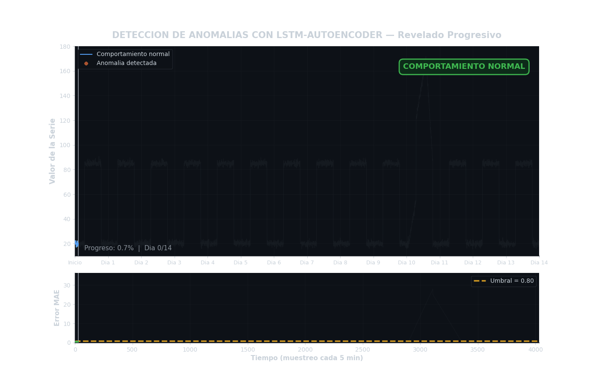

# Detección de Anomalías con LSTM-Autoencoder


---

## Tabla de Contenidos

- [1. Identificación del Problema](#1-identificación-del-problema)
- [2. Los Datos — Cómo se utilizan para resolver el problema](#2-los-datos--cómo-se-utilizan-para-resolver-el-problema)
- [3. Conclusiones Finales](#3-conclusiones-finales)
- [Tecnologías Utilizadas](#tecnologías-utilizadas)
- [Cómo Ejecutar](#cómo-ejecutar)

---

## 1. Identificación del Problema

### ¿Qué problema existe?

En industrias como banca, manufactura, salud o tecnología, es crítico saber cuándo algo se está comportando de manera anormal. Por ejemplo:

- Un banco necesita detectar transacciones fraudulentas antes de que el daño ocurra
- Una fábrica necesita saber cuándo una máquina está a punto de fallar
- Un equipo de tecnología necesita anticipar caídas de servidores

El problema es siempre el mismo: **¿cómo detectar lo anormal si no tenemos ejemplos de lo que es anormal?**

En la práctica, los casos de fraude, falla o caída son tan raros que no hay suficientes ejemplos para entrenar un modelo tradicional. Necesitamos una solución diferente.

### ¿Qué propone este proyecto?

En lugar de aprender qué es una anomalía, el modelo aprende qué es el comportamiento **normal**. Cuando aparece algo que se desvía demasiado de ese comportamiento normal, el modelo lo marca como anomalía.

> **Ejemplo:** Un detector de incendios no sabe cómo es un incendio — solo sabe cómo huele el aire normal. Cuando el olor cambia más allá de cierto límite, dispara la alarma. Este modelo funciona exactamente igual: aprende el patrón normal de los datos y detecta cuando algo se desvía demasiado.

### ¿Por qué es difícil este problema?

Los datos que se analizan son **series temporales** — es decir, mediciones tomadas a lo largo del tiempo (como el precio de una acción hora a hora, o la temperatura de una máquina cada 5 minutos). Este tipo de datos tiene una característica especial: **el valor actual depende de los valores anteriores**. Un modelo que no tenga memoria del pasado no puede entenderlos correctamente.

Por eso se usa una arquitectura LSTM (Long Short-Term Memory), una red neuronal diseñada específicamente para aprender patrones en secuencias de datos a lo largo del tiempo.

---

## 2. Los Datos — Cómo se utilizan para resolver el problema

### ¿Qué datos se usan?

Se utiliza el **Numenta Anomaly Benchmark (NAB)**, un conjunto de datos público diseñado para evaluar modelos de detección de anomalías en series temporales.

| Archivo | Contenido | Para qué se usa |
|---|---|---|
| `art_daily_small_noise.csv` | Serie temporal sin anomalías — comportamiento completamente normal | Entrenar el modelo |
| `art_daily_jumpsup.csv` | Serie temporal con saltos abruptos — anomalías reales presentes | Evaluar si el modelo las detecta |

Los datos se descargan automáticamente al ejecutar el notebook. No se requiere configuración manual.

### ¿Cómo se preparan los datos?

Antes de entrenar el modelo, los datos pasan por tres transformaciones:

**Normalización** — Los valores se escalan para que tengan media 0 y desviación estándar 1. Esto evita que el modelo se confunda por la escala de los números y aprende patrones más estables.

**Creación de ventanas temporales** — En lugar de analizar un punto a la vez, el modelo analiza bloques de 288 puntos consecutivos (equivalente a un día completo de datos). Esto le permite ver el contexto completo de cada momento.

**División entrenamiento / evaluación** — El modelo solo aprende con los datos normales. Los datos con anomalías se reservan exclusivamente para la prueba final, para verificar si el modelo las detecta sin haberlas visto antes.

### ¿Cómo usa el modelo esos datos para detectar anomalías?

El modelo sigue 6 pasos:

**Paso 1 — Comprimir:** Lee 288 puntos de tiempo y los resume en 32 números.

$$z = \text{LSTM}_{\text{encoder}}(X) \quad \rightarrow \quad z \in \mathbb{R}^{32}$$

> Es como comprimir un archivo de 1GB a 32MB. Si el archivo es normal y predecible, la compresión es buena. Si tiene contenido extraño e inesperado, la compresión falla — y esa falla es la señal.

**Paso 2 — Preparar la reconstrucción:** El resumen de 32 números se repite 288 veces para que el modelo pueda trabajar punto por punto.

$$Z_{\text{seq}} = [\,z,\; z,\; \dots,\; z\,]_{\;288 \text{ veces}}$$

**Paso 3 — Reconstruir:** El modelo intenta regenerar la serie original a partir del resumen.

$$\hat{H} = \text{LSTM}_{\text{decoder}}(Z_{\text{seq}})$$

**Paso 4 — Traducir a valores reales:** Los estados internos se convierten en números concretos mediante una transformación lineal.

$$\hat{x}_t = W \cdot \hat{h}_t + b$$

**Paso 5 — Medir el error:** Se compara lo reconstruido contra lo real usando el Error Absoluto Medio (MAE).

$$\text{MAE} = \frac{1}{288} \sum_{t=1}^{288} \left| x_t - \hat{x}_t \right|$$

- Error bajo → el modelo reconoció el patrón → dato normal
- Error alto → el modelo no pudo reconstruirlo → anomalía detectada

**Paso 6 — Definir el límite de detección:** El peor error cometido durante el entrenamiento con datos normales se convierte en el umbral. Todo lo que lo supere es una anomalía.

```
Umbral = max(MAE durante entrenamiento)

Si MAE en datos nuevos > Umbral → ANOMALÍA
```

### Flujo completo del proyecto (pipeline)

> **Pipeline** es el conjunto de pasos ordenados que siguen los datos desde que entran al sistema hasta que se obtiene el resultado. Como una línea de producción: cada etapa transforma los datos y los pasa a la siguiente.

```
1. Carga de datos (NAB)
        ↓
2. Normalización (media 0, std 1)
        ↓
3. Creación de ventanas temporales (TIME_STEPS = 288)
        ↓
4. Entrenamiento del LSTM-Autoencoder (solo datos normales)
        ↓
5. Cálculo del umbral: max(MAE) en datos de entrenamiento
        ↓
6. Evaluación en datos con anomalías
        ↓
7. Detección: muestras con MAE > umbral → ANOMALÍA
        ↓
8. Visualización de anomalías sobre la serie original
```

### Arquitectura del modelo

| Capa | Función |
|---|---|
| LSTM Encoder | Lee 288 pasos y los comprime en 32 números |
| Dropout 20% | Evita que el modelo memorice en lugar de aprender |
| RepeatVector | Prepara el resumen para la reconstrucción |
| LSTM Decoder | Reconstruye la serie punto por punto |
| Dropout 20% | Segunda capa de regularización |
| Dense (salida) | Convierte los estados internos a valores reales |

**Optimizador:** Adam · **Pérdida:** MSE · **Early Stopping:** patience=5

---

## 3. Conclusiones Finales

### ¿Funcionó?

Sí. El modelo detectó correctamente el momento exacto en que la serie temporal presentó un salto anómalo, sin haber visto ningún ejemplo de anomalía durante el entrenamiento. Las anomalías aparecen marcadas en rojo sobre la gráfica de la serie completa, concentradas exactamente en la zona del salto abrupto.

### ¿Qué aprendimos?

El enfoque no supervisado — aprender lo normal para detectar lo anormal — es viable y efectivo cuando no se tienen datos etiquetados. Este es el caso más común en problemas reales de industria.

La arquitectura LSTM es especialmente adecuada para este tipo de datos porque tiene memoria: recuerda lo que ocurrió en pasos anteriores para entender el contexto del momento actual. Una red neuronal sin memoria trataría cada punto de tiempo de forma aislada y perdería los patrones de la serie.

### ¿Qué limitaciones tiene?

- El umbral de detección se fija durante el entrenamiento. Si el comportamiento normal cambia con el tiempo, el modelo necesita reentrenarse.
- El modelo no identifica el tipo de anomalía, solo señala que algo está fuera de lo normal.
- Requiere un volumen suficiente de datos normales para aprender el patrón correctamente.

### ¿Qué sigue?

Este proyecto es una base sólida. Los siguientes pasos naturales serían aplicarlo a datos reales de una industria específica, ajustar el umbral de forma dinámica y combinar la detección con un sistema de alertas automáticas.

---

## Tecnologías Utilizadas

- **Python 3.x**
- **TensorFlow / Keras** — construcción y entrenamiento del modelo
- **NumPy / Pandas** — manipulación de datos
- **Matplotlib** — visualización

## Cómo Ejecutar

1. Abre el notebook en Google Colab o Jupyter.
2. Ejecuta todas las celdas en orden — los datos se descargan automáticamente.
3. No se requiere ninguna configuración adicional.

```bash
pip install tensorflow numpy pandas matplotlib
```

## Autor

Proyecto desarrollado como parte de un curso de **Machine Learning & AI**.  
Si tienes preguntas o sugerencias, puedes abrir un *issue* en este repositorio.
